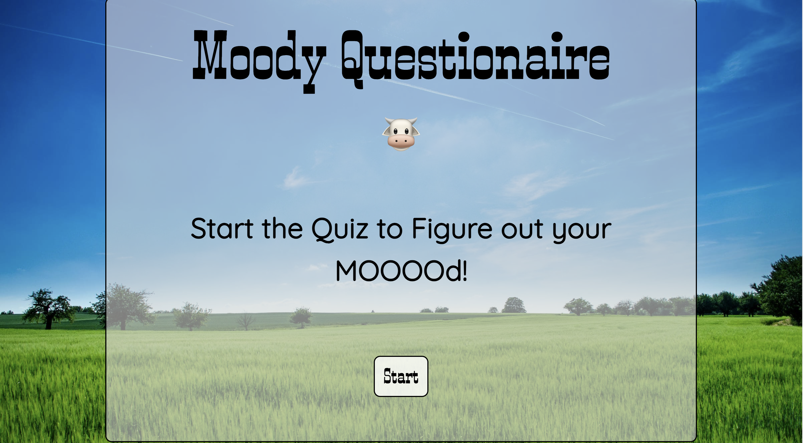

## moody
Welcome to Moody! Our goal with this page is to help boost an individuals mood. On the homepage the user is presented with two options. If the user knows their mood, they are presented with various links to aid them. If the user is unsure of their mood, they are presented with a short quiz to help determine their mood.

Each mood will have a dedicated page that captures the unique styling of the feeling. On each page, the user will be presented with relaxing music (via Youtube), inspirational/motivational quotes and gifs (via giphys).

## Authors of this project:
Madeleine Abraham- <a href="https://github.com/MadeleineA42">MadeleineA42</a> 
Katie Waters- <a href="https://github.com/kwaters3">kwaters3</a> 
Yana Mishyna- <a href="https://github.com/Ymishyna">Ymishyna</a> 
Marcus Matthews- <a href="https://github.com/Matthuu75">Matthuu75</a> 
Mike Reilly- <a href="https://github.com/MikeRei89">MikeRei89</a> 
This team did a great job with collaboration execution! 

## Link to deployed site
https://madeleinea42.github.io/moody/

## Project status
This was a really fun assignment to work on through the UCF fullstack coding bootcamp. Since this was an assignment, this particular webpage will be maintained by the original authors.  