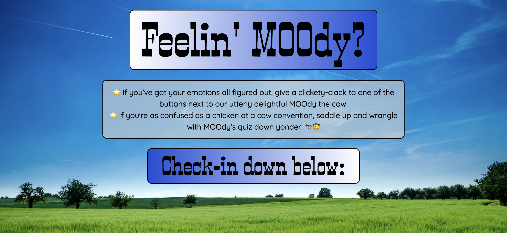

## MOOdy
Welcome to Moody! Our goal with this page is to help boost an individuals mood. On the homepage the user is presented with two options. If the user knows their mood, they are presented with various links to aid them. If the user is unsure of their mood, they are presented with a short quiz to help determine their mood.

Each mood will have a dedicated page that captures the unique styling of the feeling. On each page, the user will be presented with relaxing music (via Youtube), inspirational/motivational quotes and gifs (via giphys).





## User Story

```
AS A user
I WANT to boost my mood that I am in right now
SO that I can feel even more better overall 
```

## Acceptance Criteria

```
# Mood Selection and Display:

GIVEN a mood app with mood categories,
WHEN I select a mood category (e.g., "Happy," "Sad"),
THEN I am presented with content and activities associated with that mood,
AND the selected mood is visually highlighted or indicated.

# Boosting Mood Activities:

GIVEN the mood app displaying mood-specific content,
WHEN I explore the activities to boost my mood,
THEN I am presented with various suggestions, such as:
Inspirational quotes or messages.
Uplifting images or videos.
Relaxation techniques.
Music playlists.

# Mood Quiz and Recommendations:

GIVEN the mood app with a mood quiz option,
WHEN I take the mood quiz to determine my current mood,
THEN I am prompted with a series of questions to assess my feelings,
AND based on my responses, I receive my final mood that I can open in a separate browzer by pointing and pressing on MOOdy the cow.

# Navigation and Links:

GIVEN the mood app with navigation options,
WHEN I click on different mood categories,
THEN I am directed to the corresponding content and activities related to that mood,
AND the navigation bar or buttons clearly indicate the active mood.

# Default Mood and Reset:

GIVEN the mood app upon initial load,
WHEN I open the app without selecting a specific mood,
THEN I am presented with default mood-related content,
AND I have the option to take the mood quiz.

# Responsive Design:

GIVEN the mood app on various devices (desktop, tablet, mobile),
WHEN I access the app,
THEN the app's layout and content are responsive, adjusting appropriately to the screen size.

# User Feedback and Interaction:

GIVEN the mood app with interactive elements,
WHEN I engage with mood-specific content or activities,
THEN I receive immediate feedback (e.g., animation, change in color),
AND my interaction enhances my mood experience.

# Accessibility and Usability:

GIVEN the mood app,
WHEN I navigate and interact with the app,
THEN the app follows accessibility guidelines, providing readable text, alternative text for images.
```


## Authors of this project:
Madeleine Abraham- <a href="https://github.com/MadeleineA42">MadeleineA42</a><br>
Katie Waters- <a href="https://github.com/kwaters3">kwaters3</a><br>
Yana Mishyna- <a href="https://github.com/Ymishyna">Ymishyna</a><br>
Marcus Matthews- <a href="https://github.com/Matthuu75">Matthuu75</a><br>
Mike Reilly- <a href="https://github.com/MikeRei89">MikeRei89</a><br>
This team did a great job with collaboration execution! 


## Link to deployed site
https://madeleinea42.github.io/moody/

## Project status
This was a really fun assignment to work on through the UCF fullstack coding bootcamp. Since this was an assignment, this particular webpage will be maintained by the original authors.  